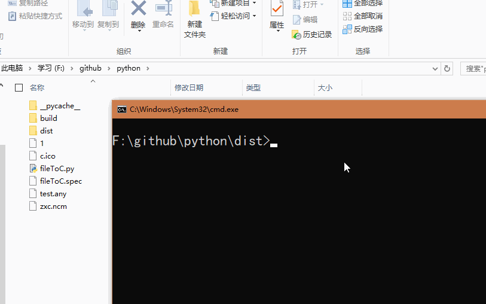

# tools

## fileToC

### 简单说明
fileToC 是一款使用 python 编写的程序，可以将任意文件的二进制数据转换为 .C 文件的数组，以便程序编译。

双击 fileToC.exe 程序，将要转换的 test.any 文件拖入命令行，等待程序自动转换，结束后便可以得到一个和该文件同名的 .c 文件

结果如下：test.any 文件的二进制数据




### 分析
这款程序的使用场景是当我们编程时，需要使用文件里面的部分或全部数据，而由于开发环境限制，无法通过文件的方式来读取，这在嵌入式系统中比较常见。那么，就可以通过将文件数据变成一个C文件，编译为常量，链接到程序中。
例如，程序中需要使用图片或音频数据，而又无法通过文件方式获得数据时，就可以这样使用。

实际上程序在转换时并不一次性将文件读入内存，而是分块进行转换，因此速度不是最快，但这可以减少内存的消耗，以支持更大的文件。另一方面，很多情况下，并不需要转换很大的文件。

同时，转换后的文件大小会是之前文件的6倍以上。这是因为，
```
raw file: 0x17;  #这只是一个字节
.c  file: 0x17;_ #_表示空格，'0' 'x' '1' '7' 
';' '_' 共6个字节 
```
但这只是 .c 文件的大小，编译后的程序中数据量和原文件大小是一样的。

### 其他
文件名不支持中文, 因为文件名作为数组名。另外文件名支持'-',但C语言不支持。

## pcmToWav

### 简单说明
PCM 数据无法直接通过播放器打开，因为少了 44 字节的文件头，这里面最主要的信息是描述该 PCM 的采样频率，通道数，以及位数。

双击 pcmToWav.exe，拖入待转换的 PCM 数据，输入通道数和采样频率，默认使用 16-bit 表示一个采样点。等待程序运行结束，就会生成一个同名的 .wav 文件。

